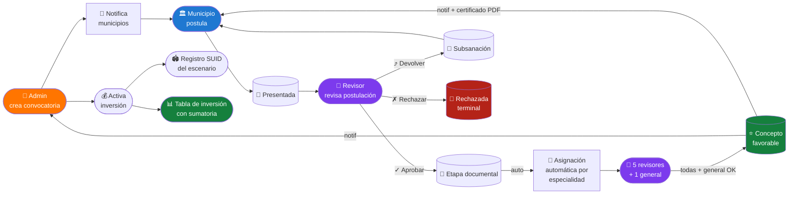
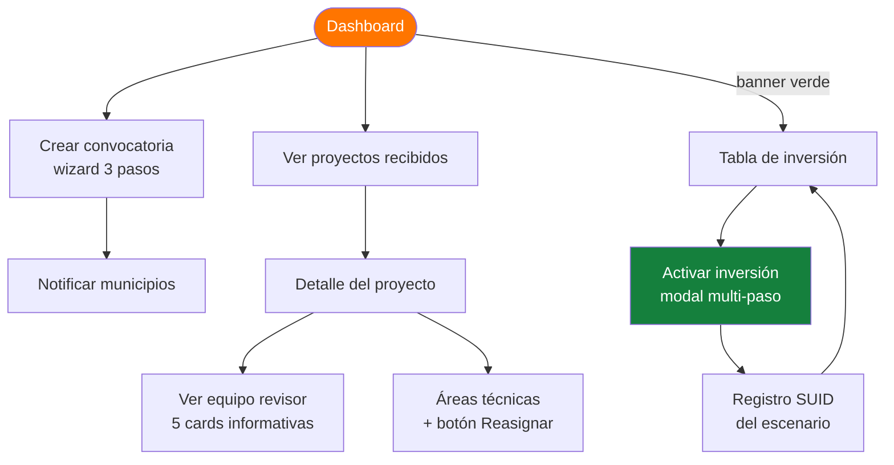
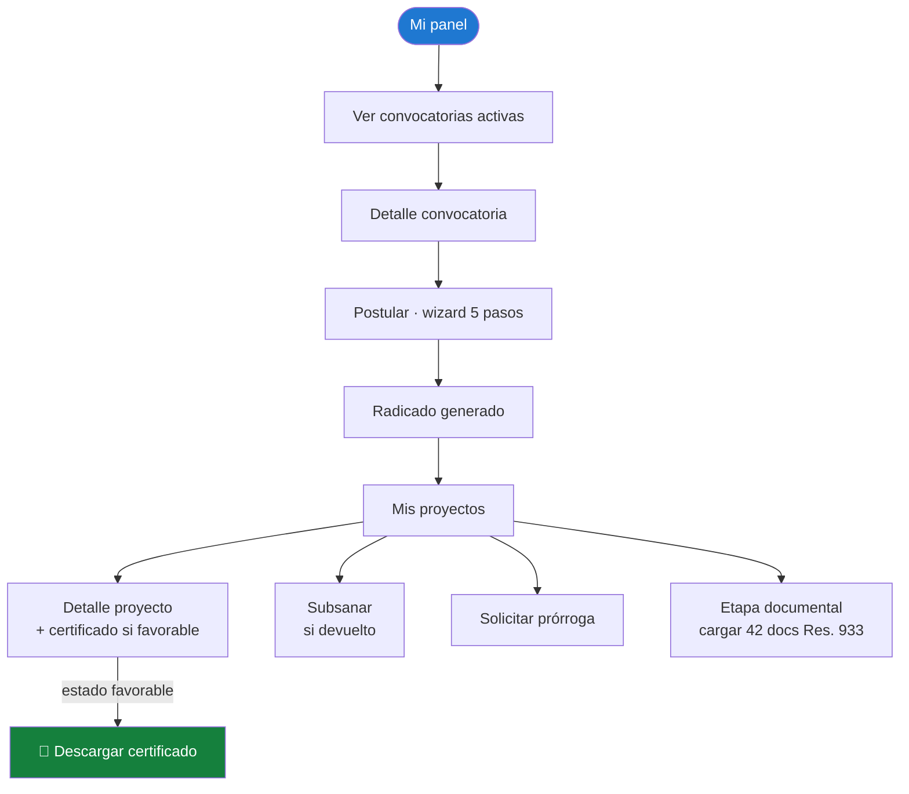
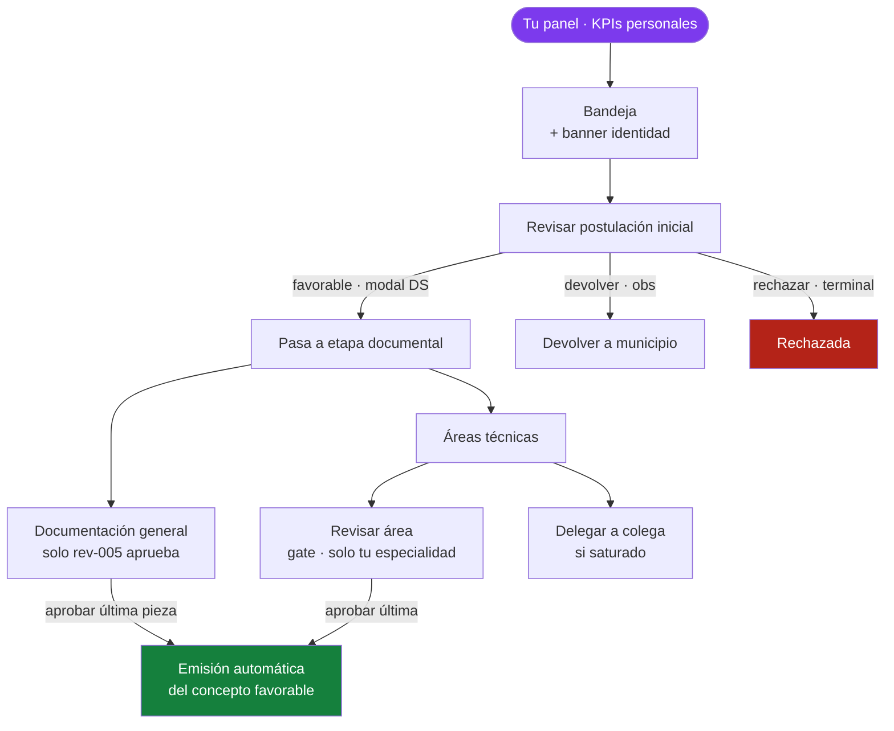

# DEMO SCRIPT — Módulo Project · Handoff a Desarrollo

> **Duración objetivo**: 25–30 min · **Audiencia**: equipo de desarrollo (Juanma + dev team) · **Modo**: pantalla compartida sobre la demo pública

**Demo URL**: https://naowee-tech.github.io/naowee-test-project/
**Doc soporte**: [FLUJO-E2E.md](./FLUJO-E2E.md)
**PR técnico**: https://github.com/naowee-tech/naowee-test-digitacion/pull/8

---

## 0 · Apertura — 2 min

**Lo que dices al iniciar:**

> *"Voy a presentarles el módulo Project en 3 partes. Primero los flujos por perfil — son 3: Admin del Ministerio, Municipio y Equipo Revisor. Después un caso end-to-end completo donde verán cómo se cruzan. Y al final dejamos los retos técnicos para que enfoquen estimación. Pueden interrumpir en cualquier momento, pero al final hay Q&A dedicado."*

**Setup técnico antes de empezar:**
1. Abrir https://naowee-tech.github.io/naowee-test-project/
2. Click "Reiniciar demo" en el chip DEMO (esquina inferior central) → state limpio.
3. Tener `FLUJO-E2E.md` abierto en otra pestaña por si necesitas referencia.

---

## 1 · Mapa global del flujo (mostrar al inicio)

**Lo que dices mostrando el diagrama:**
> *"Son 3 actores. El Admin del Ministerio abre la convocatoria, recibe postulaciones, activa inversiones. El Municipio postula y carga documentos. El Equipo Revisor — son 5 personas — aprueba las áreas técnicas y la doc general. Cuando todo está aprobado, se emite un concepto favorable automáticamente, sin paso manual del revisor. Ese es el punto clave del modelo."*

---

## 2 · Tour por rol Admin — 6 min

### 2.1 · Mostrar dashboard

**URL**: `/admin/dashboard.html`

**Lo que dices:**
> *"El admin entra y lo primero que ve son los KPIs del bienio. Aquí hay un banner verde que dice 'X proyectos listos para activar inversión' — eso es lo que dispara su acción siguiente. Es la antesala del CTA principal."*

**Flowchart Admin:**

### 2.2 · Crear convocatoria

**Click**: `+ Crear convocatoria` → wizard 3 pasos.

**Lo que dices:**
> *"3 pasos: identificación, alcance territorial, condiciones y documentos. Los campos requeridos ahora tienen el asterisco naranja del DS Naowee y el botón Continuar queda gris hasta que estén completos. La validación es transversal — el mismo helper canónico para todo el módulo."*

### 2.3 · Detalle de proyecto

**URL**: `/admin/proyecto-detalle.html?id=PROJ-2026-003`

**Lo que dices:**
> *"Aquí está la clave del modelo. Arriba un timeline visual de 4 fases: Postulación → Revisión inicial → Equipo asignado → Concepto emitido. Verás dónde está el proyecto. Debajo, un naowee-message del DS explicando EXACTAMENTE qué pasará en este momento del flujo — esto resolvió una confusión repetida del stakeholder."*

> *"El equipo revisor son 5 personas con especialidades fijas. La asignación es automática por especialidad cuando entra a etapa documental. No hay paso manual. El admin solo puede reasignar un área puntual desde el botón 'Reasignar' en cada area-card si un revisor está saturado."*

### 2.4 · Tabla de inversión

**URL**: `/admin/inversion.html`

**Lo que dices:**
> *"Tabla de proyectos activados. Sumatoria al pie estilo Excel — Presupuesto vs Aprobado en sus columnas + chip 'Ahorro' que muestra la negociación del Ministerio. Filtro por departamento recalcula los totales en vivo. Export CSV. Paginación 15 por página."*

---

## 3 · Tour por rol Municipio — 4 min

### 3.1 · Cambiar al perfil municipio

**Acción**: Click en chip DEMO inferior → "Carlos Mosquera · municipio".

**Lo que dices:**
> *"La transición es horizontal, slide suave. Sidebar y header no se mueven — toda la nav interna funciona así, hicimos un interceptor global que aplica fadeAndGo a todos los `<a>` internos. SPA-like sin SPA."*

### 3.2 · Postular un proyecto

**URL**: `/municipio/convocatorias.html` → click una convocatoria abierta → "Postular".

**Lo que dices:**
> *"Wizard 5 pasos en modal: Entidad → Proyecto → Predio → Financiero → Carta de intención. Validación canónica DS, máscara monetaria con locale es-CO. Al enviar, genera radicado `RAD-AAAA-NNN-CONV-XXXX` automáticamente."*

**Flowchart Municipio:**

### 3.3 · Etapa documental

**URL**: `/municipio/etapa-documental.html?id=PROJ-2026-007`

**Lo que dices:**
> *"42 documentos según Resolución 933. Barra de progreso que mide CARGA (lo que el municipio controla), no aprobación (lo que el revisor controla) — separamos los dos progresos. Al subir un doc, toast de confirmación + reload con la barra actualizada."*

### 3.4 · Certificado de favorabilidad

**URL**: `/municipio/proyecto-perfil.html?id=PROJ-2026-004` (proyecto con concepto favorable)

**Lo que dices:**
> *"Cuando el equipo revisor emite el concepto, el municipio ve esta card verde destacada — código del certificado, fecha, emisor, observaciones, botón de descarga. Es el primer documento oficial del flujo."*

---

## 4 · Tour por rol Revisor — 8 min

### 4.1 · Cambiar al perfil revisor

**Acción**: Chip DEMO → "Juan Manuel · revisor".

**Lo que dices:**
> *"El switcher tiene una sección 'Equipo revisor' con los 5 miembros del equipo — podemos alternar entre ellos para validar el gate de cada especialidad. Esto solo está en la demo, en producción cada uno tiene su cuenta."*

### 4.2 · Dashboard del revisor

**URL**: `/revisor/dashboard.html`

**Lo que dices:**
> *"Lo primero que ve: 'Tu carga' — KPIs personales de Juan Manuel (sus áreas pendientes, aprobadas del bienio, SLA crítico, proyectos activos). Después la tabla 'Tus áreas próximas a vencer' con top 5 por urgencia. Y al final la vista global del equipo. Identidad de actor + responsabilidad personal."*

**Flowchart Revisor:**

### 4.3 · Bandeja del revisor

**URL**: `/revisor/bandeja.html`

**Lo que dices:**
> *"Banner identidad arriba con KPIs personales. La columna 'Mis áreas' filtra cognitivamente lo que le toca al revisor activo: '2/2 pend.' rojo si SLA vencido, '2 ✓' verde si aprobó todo. Esto reemplaza el concepto de 'asignar revisor' — el equipo ya está pre-asignado por especialidad."*

### 4.4 · Revisar postulación inicial · modal DS

**URL**: `/revisor/revisar-postulacion.html?id=PROJ-2026-001`

**Click "Marcar favorable":**

**Lo que dices:**
> *"Modal nativo del DS, no el confirm() del browser. Pre-llena datos del proyecto. Cierra con Esc, backdrop o cancel. Coherente con todos los modales del módulo."*

### 4.5 · Gate "solo apruebas lo tuyo"

**URL**: `/revisor/revisar-area.html?id=PROJ-2026-003&area=arquitectonico`

**Lo que dices:**
> *"Esta área es de Juan Manuel — banner verde 'te fue asignada' con SLA. Botones aprobar/devolver habilitados."*

**Ahora cambias al chip DEMO → "Carlos Beltrán · revisor"** → misma URL.

**Lo que dices:**
> *"Mismo proyecto, misma área — pero ahora Carlos es de Suelos+Topográfico. Banner amarillo 'Área asignada a Juan Manuel Ávila — solo el revisor asignado puede aprobarla'. Botones ocultos. Vista de consulta. Esta es la regla 'todos ven, cada quien aprueba lo suyo'."*

### 4.6 · Delegación (autodelegar si saturado)

**URL**: `/revisor/doc-tecnica.html?id=PROJ-2026-003` (estando como Juan Manuel)

**Lo que dices:**
> *"En cada area-card asignada al revisor activo, hay un botón 'Delegar'. Si Juan Manuel está saturado, puede pasar un área a un colega. El popover muestra al resto del equipo y marca como 'especialista' al que cubre esa área por defecto. El admin tiene el mismo popover desde su vista — sin jerarquía obligatoria, el equipo se autogestiona."*

---

## 5 · Caso end-to-end completo — 5 min

**Lo que dices:**
> *"Para cerrar, voy a hacer un flujo completo de 1 proyecto, cruzando los 3 perfiles."*

### Paso 1 · Municipio postula
- Cambiar a municipio
- `/municipio/convocatorias.html` → entrar → Postular
- Wizard 5 pasos → enviar
- Radicado generado

### Paso 2 · Revisor recibe + aprueba postulación
- Cambiar a Juan Manuel
- `/revisor/bandeja.html` → ver la nueva postulación
- Click → revisar → click "Marcar favorable" (modal DS) → Aceptar
- Toast "Postulación favorable" + fade transition

### Paso 3 · Sistema asigna automáticamente
- El proyecto pasa a `etapa_documental` instantáneamente
- Las 8 áreas se asignan por especialidad (data.js enrichArea)
- Doc general a rev-005

### Paso 4 · Cada revisor aprueba su área
- Cambiar entre revisores via chip DEMO
- Cada uno entra a su área asignada → checklist → aprobar

### Paso 5 · Última aprobación dispara el concepto
- Toast "Concepto favorable emitido — todas las áreas + general aprobadas"
- Push notif al admin
- Push notif al municipio

### Paso 6 · Municipio ve certificado
- Cambiar a municipio
- `/municipio/proyecto-perfil.html?id=...`
- Card verde "Certificado de favorabilidad" con descarga PDF mock

### Paso 7 · Admin activa inversión
- Cambiar a admin
- Banner verde "1 proyecto listo para activar"
- Click → Tabla inversión → Activar inversión (modal multi-paso)
- BPIN + monto + centro costo

### Paso 8 · Registro SUID
- Success screen → click "Ir a Registro SUID"
- `/admin/registro-suid.html?id=...`
- Formulario 3 fases

### Paso 9 · Aparece en tabla de inversión
- Proyecto con SUID clickeable + sumatoria global actualizada

---

## 6 · Retos técnicos para desarrollo — 4 min

**Lo que dices al desarrollo:**

> *"Estos son los puntos donde quiero su input para estimación:"*

| # | Tema | Reto |
|---|------|------|
| 1 | **Persistencia real** | Hoy todo es localStorage con schema versioning (auto-reset). Para producción: backend + auth + RBAC. |
| 2 | **Asignación automática** | `enrichArea()` mapea áreas → revisores por especialidad. En producción: tabla `equipo_revisor` con especialidades y un job que asigna al cambio de estado a `etapa_documental`. |
| 3 | **SLA expirations** | Hoy es client-side (`sla-expiry.js`). En producción: cron job que marca proyectos `presentado/en_revision → expirada` después de 21d sin acción. |
| 4 | **Cierre automático del concepto** | Trigger cuando todas las áreas + general están aprobadas. Lógica está en 2 lugares (revisar-area + doc-general). Backend debe centralizar este check. |
| 5 | **Notificaciones cross-perfil** | Hoy `pushNotificacion` solo guarda en state local. En producción: email + push + queue. |
| 6 | **Registro SUID** | Hoy formulario mock. Necesita integración con el sistema SUID nacional. |
| 7 | **42 documentos Res. 933** | Hoy en localStorage. Necesita storage backend (S3 / GCS) + virus scan + límite tamaño + tipos válidos. |
| 8 | **Validación lat/lng** | Hoy se valida al submit. Pendiente: validación inline al blur con helper `--negative` (gap §10). |
| 9 | **Auto-fill DANE** | Hoy Depto y Municipio son textfields manuales. En producción: cascada Depto → Municipio con catálogo DANE. |
| 10 | **E2E tests** | No hay tests Playwright todavía. Recomendado para los 3 wizards críticos. |

---

## 7 · Q&A anticipado · preguntas técnicas comunes

### "¿Cuántos roles hay realmente?"
3 perfiles principales: admin, municipio, revisor. **Pero** el revisor son 5 personas distintas con especialidades fijas. Total: 7 personas tipo en el sistema (1 admin + 1 municipio + 5 revisores).

### "¿Por qué no hay UI para asignar manualmente un revisor?"
Decisión de Andrea + Danna del 29/04/2026: el equipo revisor es un colectivo, todos ven, cada uno aprueba lo suyo. La asignación es automática por especialidad. Solo hay override puntual (botón Reasignar/Delegar) cuando alguien está saturado. Eliminamos el paso "asignar revisor" porque no aporta — el dominio dicta el match.

### "¿Cómo se enteran los revisores de un proyecto nuevo?"
Por `pushNotificacion({perfil:'revisor', ...})`. En la demo es local; en producción será email + push. La bandeja del revisor además tiene la columna "Mis áreas" con badge rojo si hay SLA crítico.

### "¿Por qué la barra de progreso mide carga y no aprobación?"
Decisión UX. Si el municipio sube 5 documentos y la barra no avanza, parece bug. Carga es lo que el municipio controla. Aprobación es información secundaria (badge separado).

### "¿Qué pasa si el municipio sube un doc equivocado?"
El botón cambia a "Reemplazar". Sobrescribe en `docsGeneral.items[id]` con el nuevo archivo. Estado vuelve a `pendiente`.

### "¿El revisor puede rechazar definitivamente?"
Sí. Botón "Rechazar" en `revisar-postulacion.html` → estado `rechazada` (terminal, NO permite subsanación, según Res. 933 Art. 9). Es distinto de "Devolver a subsanación" que sí permite.

### "¿Qué pasa después de `en_inversion`?"
Out-of-scope para Project. La ejecución del presupuesto se maneja en otro módulo. Nuestra responsabilidad termina en activación + Registro SUID del escenario.

### "¿Por qué dos repos en GitHub?"
- PR repo (`naowee-test-digitacion`): donde vive el código y el PR técnico.
- Pages repo (`naowee-test-project`): solo para servir la demo pública.
Esto fue por bloqueo de Secret Scanning en commits históricos del repo original. Para producción, irá un solo repo limpio.

### "¿Tiempo estimado para producción?"
Depende del backend. Frontend está al 95%. Lo pendiente:
- Backend + DB schema
- Storage de documentos
- Auth + RBAC
- Notificaciones reales
- Jobs (SLA, asignación auto)
- Integración SUID nacional

Estimación cruda: 6–8 sprints para MVP funcional, asumiendo que el equipo backend toma este doc como spec.

---

## 8 · Cierre · 1 min

**Lo que dices al final:**

> *"Tienen el FLUJO-E2E.md como referencia escrita — están todos los casos, transiciones de estado, patrones UX y mapa de pantallas. La demo pública queda abierta para que la prueben. El PR técnico tiene los commits comentados con el por qué de cada cambio importante. ¿Preguntas concretas para estimación?"*

---

## 9 · Modo emergencia · te preguntan algo no anticipado

Si alguien te pregunta algo que no está en este script:

1. **No improvises** sobre temas técnicos del backend que no se han definido.
2. **Refiere al FLUJO-E2E.md** para detalle escrito.
3. **Pásame la pregunta al chat** y respondo en formato natural para que tú la digas con tono propio.

Plantilla de respuesta "lo veo y te confirmo":

> *"Esa decisión específica todavía está abierta. Lo que sí sabemos es {X}. Para no improvisar, lo dejo anotado para revisar con {Andrea/Danna/Doug} y vuelvo con respuesta concreta."*

---

**Última actualización**: 13 de mayo de 2026
**Demo desplegada**: commit `ab4fb7b`
