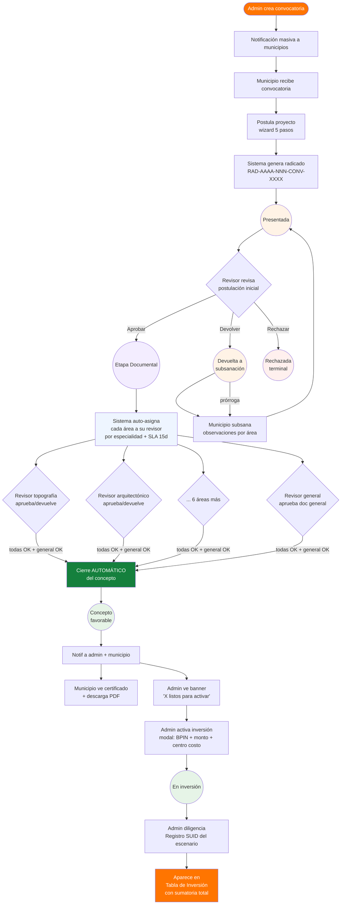
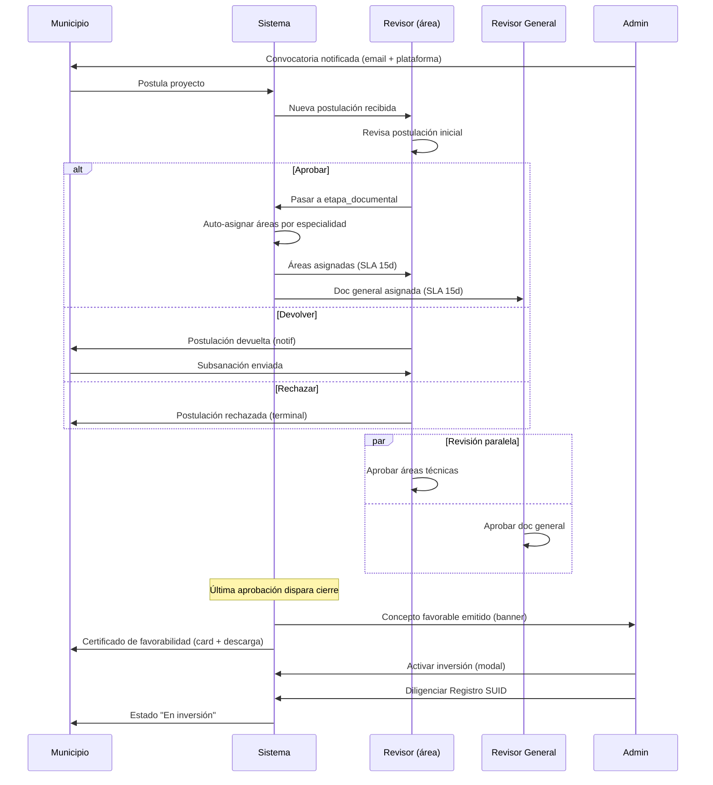

# Módulo Project — Flujo end-to-end por perfil

> **Base normativa**: Resolución 933 de 2024 (Ministerio del Deporte de Colombia)
> **Acuerdo operativo**: Acta del 29 de abril de 2026 (Andrea Rodríguez Jaraba + Danna Arrieta + Doug Vargas)
> **Demo pública**: https://naowee-tech.github.io/naowee-test-project/

---

## 1 · Resumen ejecutivo

El módulo Project digitaliza el flujo completo de **postulación, revisión y activación de inversión** para proyectos de infraestructura deportiva. Tres perfiles operan sobre el mismo proyecto en momentos diferentes del ciclo.

| Perfil | Quién | Responsabilidad principal |
|---|---|---|
| **Admin** | Administrador de Convocatorias del Ministerio del Deporte | Crea convocatorias, recibe postulaciones, activa inversión, gestiona registro SUID. |
| **Municipio** | Entidad territorial (Alcaldía, Gobernación, etc.) | Postula proyectos a convocatorias, subsana observaciones, carga documentación de etapa documental. |
| **Equipo revisor** | 5 técnicos del Ministerio (4 técnicos + 1 general) | Revisan postulación inicial, doc general y áreas técnicas; emiten concepto de favorabilidad. |

**Principio rector del equipo revisor** (acordado 29/04/2026):
> *"Todos ven el proyecto, cada quien aprueba SOLO lo de su especialidad."*

No existe un coordinador humano que asigne manualmente. La asignación de cada área técnica al revisor especialista es **automática por especialidad** cuando el proyecto entra a Etapa Documental.

---

## 2 · Mapa de flujo end-to-end



---

## 3 · Estados del proyecto y transiciones

| Estado | Quién lo dispara | Siguiente paso |
|---|---|---|
| `borrador` | Municipio (auto-guardado del modal) | Editar → enviar |
| `presentado` | Municipio (envía postulación) | Revisor abre el proyecto |
| `en_revision` | Revisor (entra a `revisar-postulacion.html`) | Aprobar / devolver / rechazar |
| `devuelta_subsanacion` | Revisor (botón "Devolver") | Municipio subsana → vuelve a `presentado` |
| `rechazada` | Revisor (botón "Rechazar") | **Terminal** — no aplica subsanación (Res. 933 Art. 9) |
| `expirada` | Sistema (SLA 21 días sin acción) | **Terminal** |
| `etapa_documental` | Revisor (aprueba postulación inicial) | Equipo revisor revisa áreas + doc general |
| `concepto_favorable` | Sistema (todas áreas + general aprobadas) | Admin activa inversión |
| `en_inversion` | Admin (modal "Activar inversión") | Diligenciar Registro SUID + reportar en tabla |

> **Nota**: Las transiciones automáticas por SLA están en `shared/sla-expiry.js` (corre 1x por sesión).

---

## 4 · Flujo detallado por perfil

### 4.1 · ADMIN (Ministerio del Deporte)

**Pantalla de entrada**: `admin/dashboard.html`

| Paso | Pantalla | Acción | Feedback |
|---|---|---|---|
| 1 | `dashboard.html` | Ver KPIs globales del bienio + banner verde "X listos para activar" si hay favorables | Banner clickeable lleva a `inversion.html` |
| 2 | `convocatorias.html` | Lista convocatorias del bienio | Filtros por estado |
| 3 | `convocatoria-crear.html` | Wizard 3 pasos para crear convocatoria | Toast "Convocatoria creada" |
| 4 | `convocatoria-notificar.html` | Notificación masiva a municipios | Lista de destinatarios + tasa de entrega |
| 5 | `proyectos.html` | Lista todos los proyectos cross-municipio | Filtros + búsqueda |
| 6 | `proyecto-detalle.html` | Detalle individual con: hero, equipo revisor (5 cards informativas, no seleccionables), datos, historial, áreas técnicas con SLA + reasignar | Card "Equipo revisor del Ministerio" muestra agregado por revisor + botón "Reasignar área" en cada área |
| 7 | (banner en dashboard / `inversion.html`) | "X proyectos listos para activar inversión" | CTA "Ver tabla de inversión" |
| 8 | Modal `activar-inversion` desde detalle | Wizard: confirmar concepto → asignar BPIN + monto + centro costo + ejecutor + SUID | Success screen con CTA "Ir a Registro SUID" |
| 9 | `registro-suid.html` | Formulario 3 fases del escenario deportivo (pre-validación → datos deportivos → documentación) | Datos pre-llenados desde inversion |
| 10 | `inversion.html` | Tabla con todos los proyectos en inversión, KPIs, filtro por departamento, sumatoria dinámica + CSV export | SUID column clickeable lleva a `registro-suid.html` |
| 11 | `inversion-crear.html` | Form admin para registrar proyecto de inversión (hoja 11 xlsx) | — |

**Asignación de revisores** (clarificación importante):
- **NO hay paso manual** "asignar revisor". Cuando el proyecto entra a `etapa_documental`, cada área se auto-asigna a su revisor por especialidad.
- El admin **puede reasignar** un área puntual (ej. revisor saturado) via botón "Reasignar área" en `proyecto-detalle.html`. Esto NO cambia el resto.

---

### 4.2 · MUNICIPIO (Entidad territorial)

**Pantalla de entrada**: `municipio/dashboard.html`

| Paso | Pantalla | Acción | Feedback |
|---|---|---|---|
| 1 | `dashboard.html` | Resumen de mis proyectos + alertas de subsanación pendiente | Chip rojo si tiene devolución pendiente |
| 2 | `convocatorias.html` | Convocatorias activas + cerradas | Estado + días restantes |
| 3 | `convocatoria-detalle.html` | Términos de referencia + botón "Postular" | — |
| 4 | Modal `postular` (5 pasos) | Wizard: entidad → proyecto → predio → financiero → carta de intención | Validación canónica DS + máscara monetaria + radicado auto-generado al enviar |
| 5 | `proyectos.html` | Mis proyectos con SLA visible | Pill SLA por proyecto |
| 6 | `proyecto-perfil.html` | Detalle de mi proyecto: hero, datos, historial, observaciones (si devuelto), **certificado de favorabilidad** (si concepto emitido) | Card verde destacada con certificado descargable |
| 7 | `subsanar.html` (si devuelto) | Subsanación multi-área en paralelo (modelo Res. 933 Art. 9) | Toast inmediato + success screen + notif al revisor |
| 8 | `prorroga.html` (opcional) | Solicitar prórroga con justificación | Confirmación + extiende SLA |
| 9 | `etapa-documental.html` (si aprobado) | Repositorio de 42 docs Res. 933 agrupados en 3 bloques | Upload + estado por documento |

**Certificado de favorabilidad** (entregable clave):
- Cuando el equipo revisor emite el concepto, el municipio recibe **notificación** + card verde destacada en `proyecto-perfil.html` con:
  - Emitido por (Equipo Revisor del Ministerio)
  - Fecha de emisión
  - Código (`CERT-FAV-{idUnico}.pdf`)
  - Observaciones del concepto
  - Botón "Descargar certificado (PDF)"
- El certificado avala el cumplimiento normativo y habilita al municipio para gestionar la inversión (con el Ministerio o con fuentes externas).

---

### 4.3 · EQUIPO REVISOR (Ministerio)

**Pantalla de entrada**: `revisor/dashboard.html`

#### 4.3.1 · Composición del equipo (5 personas, cubren 8 áreas + general)

| ID | Nombre | Especialidades técnicas | Cobertura |
|---|---|---|---|
| rev-001 | Juan Manuel Ávila | Arquitectónica + Estructural | Áreas técnicas |
| rev-002 | María Elena Cortés | Hidrosanitario + Eléctrico | Áreas técnicas |
| rev-003 | Carlos Beltrán | Suelos + Topográfico | Áreas técnicas |
| rev-004 | Andrea Quintero | Ambiental + Presupuesto | Áreas técnicas |
| rev-005 | Luis Felipe Rondón | Documentación General | Doc general (Res. 933 Bloque 1+2) |

> En la demo, el **role switcher** permite alternar entre los 5 para validar el gate.

#### 4.3.2 · Pantallas y flujo

| Paso | Pantalla | Acción | Feedback |
|---|---|---|---|
| 1 | `dashboard.html` | Card "Tu carga · {especialidad}" con KPIs personales (pendientes / aprobadas bienio / SLA crítico / proyectos activos) + tabla "Tus áreas próximas a vencer" + overview global del equipo | Saludo dinámico con cuenta de áreas mías |
| 2 | `bandeja.html` | Banner identidad + filtros estado/prioridad + columna **"Mis áreas"** con pill semántico (verde/naranja/rojo) | Pill `2/2 pend.` rojo si SLA vencido, `2 ✓` verde si todas aprobadas |
| 3 | `revisar-postulacion.html` | Checklist datos básicos → 3 botones: **Aprobar** / **Devolver** / **Rechazar** (terminal) | Modal de confirmación + notif a municipio |
| 4 | `doc-general.html` | Lista proyectos en etapa documental → entrar a uno → checklist 14 ítems | **Gate**: solo rev-005 ve botones aprobar/devolver. Otros revisores ven banner amarillo + checklist de consulta |
| 5 | `doc-tecnica.html` | Grid de 8 áreas del proyecto con estado + revisor + SLA | Cards clickeables |
| 6 | `revisar-area.html` | Checklist por área (Res. 933 Art. 3.1–3.8) → toggle Cumple/No cumple/N/A → **Aprobar** o **Devolver** | **Gate**: banner verde "Esta área te fue asignada" o amarillo "Asignada a {otro revisor}" — botones ocultos si no es tu especialidad |
| 7 | `concepto.html` | Tabla de proyectos con concepto emitido + estado | Vista de monitoreo |

#### 4.3.3 · Cierre automático del concepto favorable

```
ÚLTIMA aprobación (sea área técnica o doc general)
        ↓
¿Todas las áreas + general están aprobadas?
        ↓
       SÍ
        ↓
Sistema setea estado = 'concepto_favorable'
Sistema genera certificado CERT-FAV-{idUnico}.pdf
Push notificación al admin → banner "X listos para activar"
Push notificación al municipio → card verde + descarga
Push historial → "Concepto de favorabilidad emitido"
```

No hay paso manual de "emitir concepto". El revisor que aprueba la última pieza ve un toast: **"Concepto favorable emitido — todas las áreas + general aprobadas. Certificado disponible para municipio y admin."**

---

## 5 · Patrones UX clave

### 5.1 · Notificaciones cross-perfil

| Trigger | Quién dispara | Quién recibe | Dónde se ve |
|---|---|---|---|
| Convocatoria creada | Admin | Municipios | Banner en `municipio/dashboard.html` |
| Postulación enviada | Municipio | Revisor | Notif en bandeja del revisor |
| Postulación devuelta a subsanación | Revisor | Municipio | Chip + observaciones en `proyecto-perfil.html` |
| Postulación rechazada | Revisor | Municipio | Estado terminal |
| Doc general devuelta | Revisor general | Municipio | Notif tipo subsanación |
| Área técnica devuelta | Revisor especialista | Municipio | Notif tipo subsanación |
| **Concepto favorable emitido** | Sistema | Admin + Municipio | Banner verde en admin + card certificado en municipio |
| Inversión activada | Admin | Municipio | Estado pasa a "En inversión" + hero verde |

### 5.2 · SLA por área (Res. 933 Art. 3)

- **15 días calendario** desde la asignación automática.
- Visualizado como pill semántico:
  - 🟢 `>7d restantes` (verde)
  - 🟡 `4–7d restantes` (naranja claro)
  - 🔴 `≤3d` o vencido (rojo)
- El SLA aparece en: `proyecto-detalle.html` (áreas técnicas), `revisar-area.html` (banner del área), `bandeja.html` (columna mis áreas), `revisor/dashboard.html` (tabla próximas a vencer).

### 5.3 · Gate "solo apruebas lo tuyo"

Implementado en:
- `revisar-area.html`: banner verde/amarillo + botones ocultos según especialidad.
- `doc-general.html`: idem para rev-005.

Patrón visual:
- **Verde** (`naowee-message--positive`): "Esta área te fue asignada — Asignada a ti el dd-mmm. SLA: X días restantes."
- **Amarillo** (`naowee-message--caution`): "Área asignada a {revisor}. Solo el revisor asignado puede aprobarla. Estás logueado como {tú} — puedes consultar pero no decidir."

### 5.4 · Reasignar área (admin override)

Solo el **admin** puede reasignar un área puntual desde `proyecto-detalle.html`:
1. Click en ícono de flechas en `area-card__reassign`.
2. Popover lista los 4 revisores técnicos (excl. general).
3. Marca al especialista correcto.
4. Click → setea nuevo `revisorId` + reinicia SLA + push historial.

---

## 6 · Diagrama de notificaciones



---

## 7 · Identidad del equipo revisor (clarificación stakeholder)

**Pregunta frecuente**: *"¿El admin asigna manualmente a un revisor por proyecto?"*

**Respuesta**: NO. El modelo acordado el 29/04/2026 con Andrea + Danna es:

1. El equipo revisor del Ministerio es **un colectivo de 5 personas** con especialidades pre-asignadas en el sistema.
2. Cuando un proyecto entra a **Etapa Documental**, cada área técnica se vincula **automáticamente** al revisor que tiene esa especialidad.
3. La doc general se vincula al **Revisor General** (rev-005).
4. Cada revisor ve todos los proyectos en su bandeja pero **solo puede aprobar/devolver lo de su especialidad** — el gate visual (banner verde/amarillo) refuerza esta regla en cada pantalla.
5. El admin puede **reasignar puntualmente** un área (no un proyecto entero) si un revisor está saturado, en vacaciones o si la especialidad inicial fue incorrecta.
6. **No hay coordinador humano** que asigne 1-a-1. Es asignación por especialidad.

---

## 8 · Pantallas — mapa completo

```
admin/
├── dashboard.html              · KPIs + banner "listos para activar"
├── convocatorias.html          · Lista convocatorias
├── convocatoria-crear.html     · Wizard crear
├── convocatoria-detalle.html   · Detalle + asignar revisor (legacy, ya no necesario)
├── convocatoria-notificar.html · Notificación masiva
├── proyectos.html              · Lista cross-municipio
├── proyecto-detalle.html       · Hero + Equipo revisor + Áreas técnicas con reasignar
├── inversion.html              · Tabla con KPIs + filtro + sumatoria + CSV
├── inversion-crear.html        · Form admin (hoja 11 xlsx)
└── registro-suid.html          · Formulario 3 fases del escenario

municipio/
├── dashboard.html              · Resumen + alertas
├── convocatorias.html          · Convocatorias activas
├── convocatoria-detalle.html   · TDR + botón postular
├── proyectos.html              · Mis proyectos + SLA
├── proyecto-perfil.html        · Detalle + certificado favorabilidad
├── postular.html               · Wizard 5 pasos
├── subsanar.html               · Subsanación multi-área
├── prorroga.html               · Solicitud de prórroga
└── etapa-documental.html       · Repositorio 42 docs Res. 933

revisor/
├── dashboard.html              · Tu carga + Próximas a vencer + overview
├── bandeja.html                · Banner identidad + columna "Mis áreas"
├── revisar-postulacion.html    · Checklist + Aprobar/Devolver/Rechazar
├── doc-general.html            · Checklist 14 ítems (gate por rev-005)
├── doc-tecnica.html            · Grid 8 áreas
├── revisar-area.html           · Checklist área (gate por especialidad)
└── concepto.html               · Monitoreo de conceptos emitidos

shared/
├── data.js                     · Modelo + state + enrichment runtime
├── states.js                   · Transiciones + diasRestantes
├── shell.js                    · Sidebar + header + role switcher (5 revisores)
├── modal-postular.js           · Modal wizard postulación
├── modal-convocatoria.js       · Modal wizard convocatoria
├── modal-activar-inversion.js  · Modal wizard activar inversión
└── pages.css                   · Estilos compartidos
```

---

## 9 · Cómo se prueba la demo

1. Entrar como **Admin** (Andrea Rodríguez) en https://naowee-tech.github.io/naowee-test-project/
2. Ver banner verde "2 listos para activar" → ir a tabla de inversión.
3. Cambiar al **Equipo revisor** desde el chip "DEMO" inferior.
4. Ir a `revisor/dashboard.html` como Juan Manuel Ávila → ver KPIs personales.
5. **Cambiar de revisor**: desde el chip DEMO, sección "Equipo revisor", elegir Carlos Beltrán → ahora el gate cambia.
6. Entrar a un área de topografía → ver banner verde "te fue asignada" (Carlos es el especialista).
7. Volver a Juan Manuel → entrar a la misma área de topografía → ver banner amarillo "Asignada a Carlos Beltrán".
8. Entrar a `doc-general.html` como Juan Manuel → banner amarillo (rev-005 es el único que aprueba).
9. Cambiar a Luis Felipe Rondón → entrar a `doc-general.html` → ahora ves los botones aprobar/devolver.
10. Como **Municipio** (Carlos Mosquera) → entrar a un proyecto en estado "Concepto favorable" → ver card verde con certificado descargable.

---

## 10 · Próximas iteraciones (post-15-may)

| # | Tema | Origen |
|---|------|--------|
| 1 | Validación lat/lng inline con helper `--negative` al `blur` (registro-suid) | HANDOFF §10 |
| 2 | Auto-fill cascada Departamento → Municipio (catálogo DANE) | GAP-ANALYSIS |
| 3 | Validación `apertura < cierre` en modal-convocatoria paso 1 | HANDOFF §10 |
| 4 | Persistencia real (hoy todo es localStorage) | HANDOFF §10 |
| 5 | E2E tests Playwright para los 3 wizards | HANDOFF §10 |
| 6 | A11y audit (focus, aria-live, keyboard) | HANDOFF §10 |

---

**Documento generado**: 13 de mayo de 2026
**Última actualización del módulo**: commit `860ef73` (PR `naowee-tech/naowee-test-digitacion#8`)
